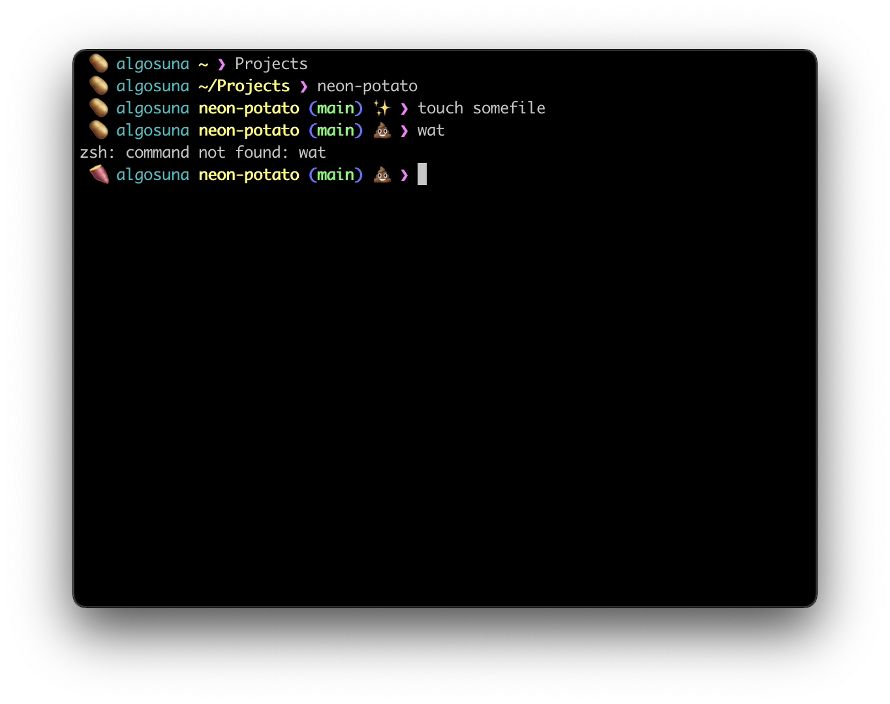

### Neon Potato
Nenon potato is a colorful [oh-my-zsh](https://ohmyz.sh) theme for [z shell](https://www.zsh.org/).

  

### Installation
1. `mkdir $ZSH_CUSTOM/themes` _You can skip this command if the directory exists already_
2. `wget -O $ZSH_CUSTOM/themes/pi.zsh-theme https://raw.githubusercontent.com/algosuna/neon-potato/master/neon-potato.zsh-theme`
3. `vim ~/.zshrc`
4. Set `ZSH_THEME="neon-potato"`
